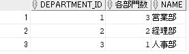
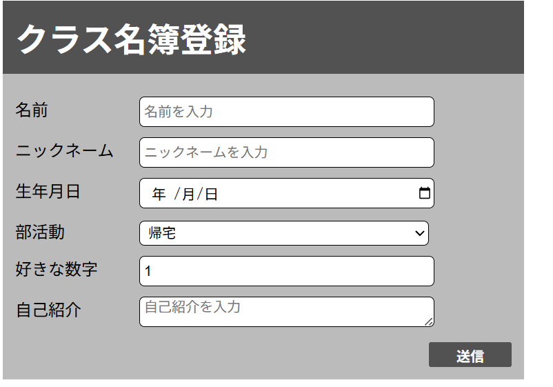

####　2025/10/11 技術基礎復習（多角的な知識定着）

#### 実施内容
* **Java**:`HashMap`の出力順序に関する仕様の検証。
  * パッケージを使用した標準的な**コマンドラインでのプログラム操作**を確認。 
  * **配列**と**文字列**の長さ取得方法の違いを実装を通じて明確化。
* **Oracle Database**:データベースの**キーの種類と各役割**（主キー、外部キーなど）を復習。
* **SQL**:`JOIN`,`GROUP BY`,`HAVING`など、**データ結合と集計**のための複合的なSQL文をOracle SQL Developerで実行し、動作を再確認。

#### 課題と技術的な解決
1. **HashMapの順序保証**:
   * **検証結果**:要素数が少ない場合、`HashMap`の出力順序が追加順と一致することがあったが、これは**偶然の一致**であり、`HashMap`は**順序を保証しない**という仕様を再確認。
   * **解決**:順序保証が必要な場合は、`LinkedHashMap`など、目的に合った適切なクラスを使用する必要があると結論付けました。
2. **Javaの長さ取得方法の混同**:
   * **現象**:配列（`.length` 属性）と文字列（`.length()`メソッド）の取得方法を混同。
   * **解決**:実際に実装し、**構文エラー（シンボルをみつけられません）**から、
3. **SQL構文エラー ORA-00942**:
   * **エラー**:`ORA-00942:表またはビューが存在しません`が発生。
   * **原因**:SQL文中の**テーブル名のスペルミス**。
   * **解決**:権限付与の問題ではないことを切り分け、エラーコードとメッセージから原因を**テーブル名に特定**し修正。

#### 実行したSQLクエリの例
集計と結合を組み合わせ、各部門の人数と部門名を取得。
```sql
SELECT
department_id, COUNT(*) AS 各部門数
,d.name AS name
FROM employees e
JOIN departments d ON e.department_id = d.id
GROUP BY department_id,d.name;
```




#### 学び
* **知識定着の重要性**:HTML/CSS/Java/SQLを復習して、手を動かしつづけて、説明を読む、理解するという行動を毎日やる必要性を強く感じた。
* **完璧主義と計画の見積もり**:復習中に完璧を目指しすぎたため、予定していた全項目を消化できなかった。
  * この経験から、実務でも発生する　**「学習時間の見積もりの難しさ」**　を痛感。今後は、学習計画に余裕を持ったバッファを設定し、深堀り（完璧主義）と網羅性（計画完遂）のバランスをとる重要性を意識する。
* **情報の優先順位**:英語ドキュメントの読解はスキルアップに不可欠と理解しつつも、現状の学習進捗と課題解決を最優先することにします。
* **キーの役割**:データベースの**キー（主キー、外部キー）**は、単なる制約ではなく、データ間の関係性を定義する重要な概念であり、再度インプットを強化する。

#### 2025/10/09 & 10/10 HTML/CSS基礎学習

#### 実施内容
* **HTML要素の設定**: **テーブル**および**フォーム要素**（ラジオボタン、テキストエリア、入力必須性、`required`）の実装と表示確認。
* **CSS基本設定**: 外部ファイルでの記述方法を確認。キャッシュ問題の解決と対策を学習。
* **基本プロパティとモデル**: **ボックスモデル**(Padding,Border,Margin)の基本を実装し、CSSによる視覚的な変化を習得。
* **レイアウトとスタイリング**: `display`プロパティなどを調査し、ラベルとブロック要素の横並びを実装。実習として簡単な**クラス名簿登録フォーム**を作成。

#### 課題と解決
1. **構文エラーとデバッグ**:テーブル作成時の**スペルミス**により想定外の表示が発生。
* **解決**:テキスト比較ツールを活用し、エラー原因を迅速に特定・修正。**ツールの利用による効率的なデバッグ**を経験。
2. **プロパティの混同**:`font-size`（大きさ）と`font-weight`（太さ）を混同し、意図しない表示に。
* **解決**:プロパティの仕様を都度正確に確認する習慣を徹底。仕様に基づいたスタイリングになっているかを確認する重要性を再確認。

#### 深い学びと考察

1. **なぜ`id`は一意であるひつようがあるか？**:
* **理由**:`id`は、HTML要素を**一意に識別**するため。主に**JavaScriptによる特定要素の操作**、またはページ内リンクのターゲットとして利用され、識別子が一意でないとプログラムの挙動が不安定になるため。
2. **`rem`の使いどころ**:
* **確認**:公式ドキュメントを参照し、`rem`が**ルート要素（`<html>`）の`font-size`に依存する**単位であることを理解。レスポンシブなデザインや、ユーザーの環境設定に合わせたフォントサイズ調整に有効であることを確認。
3. **ブラウザのデフォルトリセット**:
* **理由**:`margin: 0`を設定するのは、ブラウザごとに異なる**デフォルトの余白スタイルをリセット**し、デザインを統一的に制御するため。
4. **CSSセレクター（ドット`.`）の役割**:
* **理解**:ドット(`.`)は**クラスセレクター**であり、HTML要素の`class`属性で指定されたクラス名を持つ要素にスタイルを適用するための構文。
5. **`display: block;`の意義**:
* **理解**:CSSで`display: block;`を指定することは、元々インライン要素だった要素に**ブロックレベル要素特有の特性（横幅全体を占有し、前後に改行が入る）** を持たせ、柔軟なレイアウト制御(`width`や`height`の指定など)を可能にする。

#### 今後の意識
* **Java/Spring Bootとの連携**:作成したフォームは、今後Javaのバックエンドと連携させるための**フロントエンドの基盤**。`form`タグや各種入力要素の扱い方を完全に近い状態にもっていき、CSSとの組み合わせで柔軟にスタイリングできるよう、さらに練習を重ねる。
* **検索力の強化**:スタイリングの変化に面白さと難しさを感じた。多様なプロパティを前に、**「何を知りたいか」を正確に言語化し、検索する力**を徹底的に強化する。
* **ユーザビリティ**:送信ボタンに`hover`効果を実装したように、単なる表示だけでなく、**ユーザーにとってわかりやすいUI/UX**を意識した実装を目指す。


**作成したフォームの表示**


送信を押すときに、`hover`が効いて背景と、文字色がかわります。
そのほかは、どこにでもあるようなフォームです。
（初期値の設定、プレースホルダーの設定。）

### 2025/09/30 & 10/08 HTML基礎学習

#### 実施内容
* **HTML基本構成と要素**: Webページ構築に必要な基本構造（`<head>`, `<body>`）とルールを学習。
* **要素の特性**: **ブロック要素**と**インライン要素**の違いを実装を通じて確認。
* **構造と階層**: **親要素（ノード）** と子要素の関係性をMDN を参照しながら確認。
* **リスト要素の実装**: `<ul>`, `<ol>`, `<li>` などのリスト要素を実際にコーディングし、表示を確認。

#### 学びと意義

1.  **Web表示の基本原理**: HTMLはブラウザで手軽に結果を確認できるため、学習を進めやすいことを実感。
2.  **Spring Boot開発への接続**: これらの学習は、現在進行中のJavaでのWebアプリケーション開発において必須の基礎知識です。特に、ブロック/インライン要素やノードの関係性は、**Spring Bootと連携するテンプレートエンジン（例: Thymeleaf）** を使って動的な画面を構築する際の土台になります。
3.  **知識の参照先**: MDNなどの**公式ドキュメント（または信頼できる資料）** を参照して知識を裏付けする習慣は、今後のプログラマーとしてのキャリアに不可欠だと再認識した。

#### 今後の意識
* 単に要素を並べるだけでなく、Webアプリのデータ構造を意識し、**セマンティック（意味的）** で構造的なHTMLを記述できるように学習を進める。
* 次はCSSの学習に移り、Javaで処理したデータを **「どのように表示するか」** というWebアプリ開発の全体像を固める。
### 2025/09/26 SQL操作
#### 実施内容
* **データ操作:**`SEQUENCE`の作成、削除、`NEXTVAL`による値の取得といった一連の操作を実践。
* **データ検索:**`DUAL`テーブルの利用目的を把握し、データの全件取得と並び替え（`ORDER BY`）を実施。
* **トラブルシューティング:** SQLの構文エラー（`ORA-00904`）および論理的なクエリ設計ミスを解決。

#### 課題と解決
1. **ORA-00904(無効な識別子)**
    * **現象** `ORA-0904: 無効な識別子です`というエラーが発生。
    * **原因**　ほとんどの場合、カラム名やテーブル名の**スペルミス**が原因であることを確認。
    * **解決** エラーメッセージの内容（無効な識別子の名前）を正確に読み取り、スペルミスを修正することで解決。基本的なエラー読解の重要性を再認識しました。
2. **SQL文の論理的組み立てミス**
    * **課題:**`GROUP BY`で集計した結果を、さらに`ORDER BY`で並び替えるという、**「集計後の並び替え」**　の考え方がすぐに適用できなかったです。
    * **原因:**`GROUP BY`と`ORDER BY`がそれぞれ「集計」と「表示順」という異なる役割をもっているという**個々の特性の把握が曖昧**だったため。
    * **解決:** **「実現したいこと」を言語化**し、どの機能（句）を組み合わせるべきかを論理的に組み立てる練習を繰り返すことで、クエリ設計の精度を向上させる。
#### 学びと今後の意識

* **基礎知識の定着**:　今回、`SEQUENCE`操作を成功させ、Oracle固有の機能に関する理解を深めることができた。
* **トラブルシューティング**: 構文エラー（`ORA-00904`）は初歩的であっても、**エラーメッセージを正確に読むこと**がもっとも早い解決策であると再確認しました。
* **ワイルドカードの整理**: `WHERE`句で使うワイルドカード(`%`や`_`)の仕様を混同しないよう、改めてメモに整理しました。
* **目標**: 今後は、SQL文の各句(`GROUP BY`,`ORDER BY`,`HAVING`など)を**個別の機能としてだけでなく、連携させる論理的な設計**を意識して学習を進める。
### 2025/09/25 SQL操作（JOINと集計）

#### 実施内容
* **テーブル結合とデータ集計の利用**：`JOIN`句、集計関数、`GROUP BY`句を用いたデータ操作。
* **集計処理におけるエラー解決**：`ORA-00979`および`ORA-00937`エラーの根本原因分析と解決。
* **絞り込み条件の適用**：`HAVING`句を用いたグループ化後のデータ抽出。

#### 課題と解決（集計処理の壁）

1.  **ORA-00979 (GROUP BYの指定不足)**
    * **現象**: `GROUP BY`句を記述したにも関わらず、集計に必要なカラムが不足しているというエラーが発生。
    * **原因**: `SELECT`句で指定した非集約カラム（集計関数に含まれないカラム）が、すべて`GROUP BY`句に含まれていなかったため。
    * **解決**: `SELECT`句の内容と照らし合わせ、不足していた非集約カラムを追加し、**集計と非集計のバランス**を正しく取ることで解決。

2.  **ORA-00937 (GROUP BYの記述漏れ)**
    * **現象**: 単一カラムとグループ関数を同時に表示しようとした際、SQLがどのグループで集計すべきかを判断できずにエラーが発生。
    * **原因**: 集約関数と非集約カラムを混在させているにもかかわらず、**`GROUP BY`句そのものが抜けていた**ため。
    * **解決**: エラーメッセージから`GROUP BY`句の不足を確認し、非集約カラムを指定することで、どの単位で集計するかを明確にした。

#### 学びと考察

* **SQLの基本原則の再認識**: 今回の連続したエラー（`ORA-00979`, `ORA-00937`）から、SQLの集計処理における**「集約関数と非集約カラムの共存には、必ず`GROUP BY`が必要」**という基本原則を深く理解できた。
* **クエリ設計の意識**: `JOIN`と`GROUP BY`を組み合わせた複雑なクエリを書く中で、**「実現したいこと」を正確に言語化し、正しいSQL文に落とし込む力**の重要性を痛感した。
* **`HAVING`句の役割**: `COUNT(EXPENSE) > 1`などの具体例を通じて、`WHERE`がレコードの絞り込み、`HAVING`が**グループ化された結果の絞り込み**に使うという違いを明確に把握した。
* **ユーザビリティへの配慮**: 今後は、出力結果を見る側の視点を意識し、**`AS`句（エイリアス）**を使ってカラム名を分かりやすく命名する工夫や、**`ORDER BY`句**によるカラムの表示順序を意識したクエリ設計を心がける。

### 2025/09/24 SQL操作とトラブルシューティング

#### 実施内容
* Oracle SQL Developerの基本的な操作（接続パネルの再表示）
* SQLにおけるカラムの削除方法
* `ORA-01400`エラーの解決と原因分析
* `INSERT`文によるデータの追加

#### 課題と解決

1.  **ツールの操作ミス**: 接続パネルを誤って削除。
    * **解決**: メニューから再表示することで解決。ツールの基本的なUI操作を把握しておくことの重要性を再認識した。
2.  **必須列の指定漏れによるエラー**: `ORA-01400`エラーが発生。
    * **原因**: `INSERT`文で、必須列（`NOT NULL`）を指定していなかったため。
    * **解決**: `INSERT`前に `DESCRIBE` コマンドでテーブル構造を確認する習慣をつけることで、必須列を漏れなく指定するようにした。
3.  **データ表示順の誤解**: `INSERT`したデータがテーブルの末尾ではなく、先頭に表示されるという現象。
    * **原因**: SQLのテーブルに物理的な「上」「下」の概念はない。表示順はデータベースの最適化によって決まるため、特定の順序で表示するには `SELECT ... ORDER BY ...` を使用する必要がある。
    * **学び**: `INSERT`はデータを追加するだけであり、表示順は `SELECT` 文で制御するという、基本的な概念を深く理解できた。

### 2025/09/21 SQL操作とデータ移行

#### 実施内容
* 既存テーブルから新規テーブルへのデータ移行
* `UPDATE`文を使ったデータ更新と、データの整合性確保
* 複数のテーブル結合と`WHERE`句による複雑なデータ抽出

#### 課題と解決
1.  **データの自動採番**: Oracleデータベースには自動採番機能がないことを把握しておらず、データの挿入に苦戦。
    * **解決**: シーケンス（Sequence）を作成し、`NEXTVAL`を使って連番を生成することで対応。
2.  **データ移行と更新**: 既存テーブルから値を取り出して別のテーブルに挿入する際、構文理解が不十分だったため時間がかかりました。
    * **解決**: SQLの基本構文（`INSERT INTO ... SELECT ...`）を見直し、正しい構文を記述することで解決。
3.  **UPDATE文の更新対象**: `UPDATE`文使用時に、データの型不一致やエイリアスの指定漏れにより、意図しないデータ更新が発生。
    * **解決**: **データの型**と**エイリアス**を厳密に意識して記述することで、更新対象を明確にし、間違いを防ぎました。

#### 学び
* データベースのバージョンや種類（今回の場合はOracle）によって、構文や機能に違いがあることを再認識。
* **SQLの基本構文**は、複雑な処理を行う上で土台となりそうなので、常に基礎に立ち返ることが重要そうだと思いました。
* 実践的なSQLスキルを身につけるには、多様な結合方法と`WHERE`句の組み合わせを**繰り返し練習**し、**「何をしたいか」をSQL文で表現する力**を養う必要があると思いました。練習できるサイトをいくつか見つけたので、そちらを活用していく方向にします。

# 2025/09/20 SQL操作とトラブルシューティング

## 実施内容

* 既存テーブルへのデータ追加・修正作業
* 意図しないデータのクリーニング
* 複数のテーブルを関連付けた `UPDATE` 文の実行

## 課題と解決

1.  **意図しないデータの追加**: 誤ってデータを追加してしまったため、`DELETE`文を使ってデータのクリーニングを実施した。SQL操作におけるリスク管理と、`ROLLBACK`の重要性を再認識した。
2.  **テーブル関連付けにおける `UPDATE` 文**: 
    -   複数のテーブルを紐付けて一意のIDを更新する課題で苦戦。
    -   原因は、**Oracleデータベースにおける特定の構文**と、`FROM`・`WHERE`句の理解不足だった。
    -   最終的には、インターネット検索と公式ドキュメントを参照し、正しいSQL文を記述することで解決。

## 今後の学習方針

-   `FROM`・`WHERE`句など、SQLの基礎文法を「メモで済ませる」のではなく、**「自力で書けるようになる」**まで繰り返し演習する。
-   今回の経験から、実践的な学習においては、バージョンや環境による構文の違いを意識し、公式ドキュメントを確認する習慣を身につける。